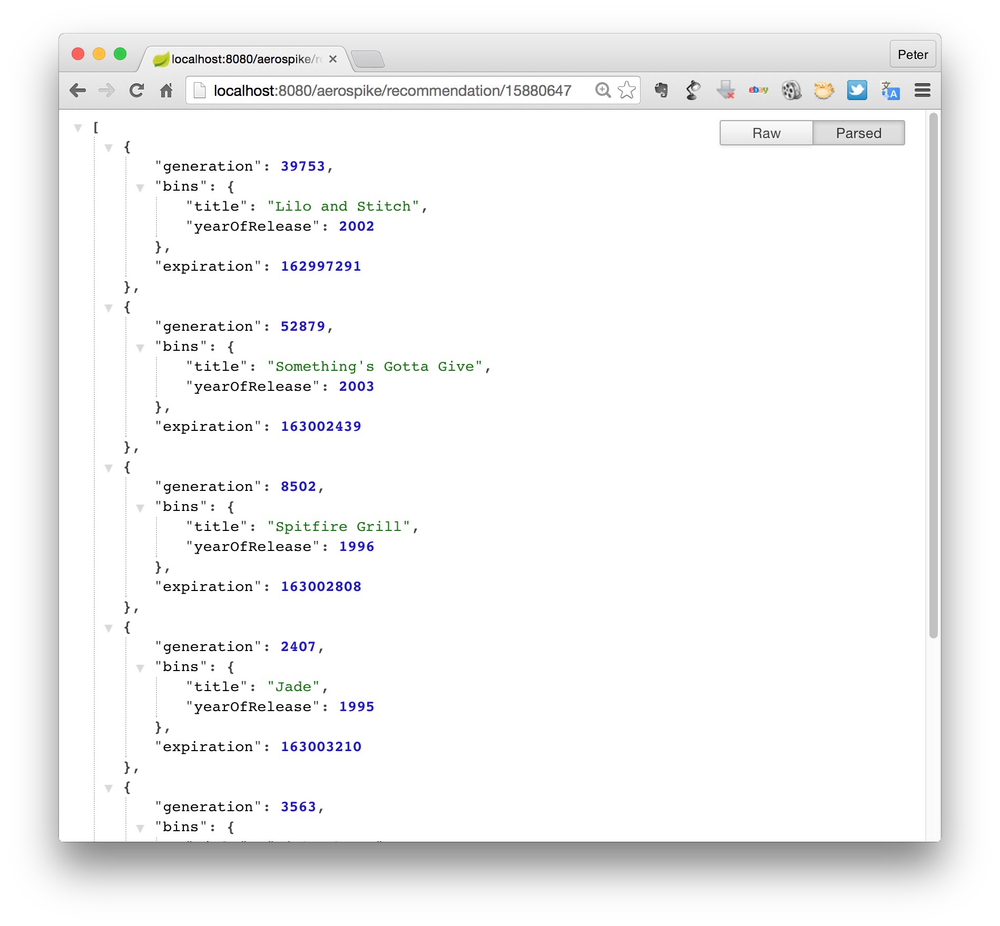

#Building a Recommendation Engine with Aerospike, MongoDB and Spring Boot 

Author: Peter Milne, Aerospike Director of Application Engineering

**Recommendation engines** are used in applications to personalize the user experience. For example, e-commerce applications recommend products to a customer that other customers -  with similar behavior - have viewed, enjoyed, or purchased. News applications would use a real-time recommendation engine, as stories come and go quickly. These application additions improve the user experience, increase sales and help retain customer loyalty. This guide contains example code for a real-time, non-contextual, cosine-similarity based engine. 

This example uses the **Spring Boot** application environment, a powerful jump-start into the versatile Spring Java based web application framework. With Spring Boot you can build powerful applications with production grade services with little effort - and easily launch and enjoy the enclosed example. This example can be translated into other frameworks.

The **Aerospike** and **MongoDB** are the databases you can use as the storage engines. You can choose to use one or both. 

**Aerospike** is a highly available, low latency NoSQL database that scales out linearly - thus easy to run an online service. It is well suited to this example because it scales both horizontally (out to multiple nodes in a cluster) and vertically being completely multicore and NUMA node aware. It is an in-memory database optimized to use both DRAM and native Flash. Aerospike boasts latencies averaging less than 1 millisecond with well more than 100,000 queries per second per server with high availability and immediate consistency. This is all automatic and zero-touch.

**MongoDB** has a nice programatic interface and uses a fashionable JSON dialog between client and server. We did find some challenges in scaling MongoDB with its approach to clustering and high availability.

##What you will build
This guide will take you through accessing the Github repository containing the project, and creating a simple recommendation service. The provided engine will use Similarity Vectors to recommend a product - in the case of the example data set, movies - to a customer. The algorithm for this is very elementary, and will provide a starting point for real-time recommendation research, but also will provide recommendations based on the demonstration data provided.

To provide a recommendation in real-time, you will need a database that can retrieve your data very quickly, as several database requests will be necessary to do the full recommendation. If your database is too slow, you will find - even over reasonable data sets - that the recommendation time is slow. 

You could try this with any database, in this exercise we will use both the Aerospike NoSQL database  and the MongoDB data base. This will allow us to evaluate the merits of both NoSQL databases.

You will build a service that accepts an HTTP GET request:

	http://localhost:8080/aerospike/recommmendation/{user}

or

	http://localhost:8080/mongo/recommmendation/{user}

It responds with the following JSON array of recommendations:
```json
[
  {"expiration":130019315,
   "bins":
     {"title":"Classic Albums: Meat Loaf: Bat Out of Hell",  "yearOfRelease":"1999"},
   "generation":4},
  {"expiration":130019337,
   "bins":
     {"title":"Rudolph the Red-Nosed Reindeer",
"yearOfRelease":"1964"},
   "generation":4},
  {"expiration":130019338,
   "bins":{"title":"The Bad and the Beautiful",
    "yearOfRelease":"1952"},
   "generation":4},
  {"expiration":130019384,
   "bins":
    {"title":"Jingle All the Way","yearOfRelease":"1996"},
   "generation":4},
  {"expiration":130019386,
   "bins":
     {"title":"The Killing","yearOfRelease":"1956"},
  "generation":4},
  {"expiration":130019400,
 "bins":
  {"title":"Silkwood","yearOfRelease":"1983"},"generation":4},
  {"expiration":130019404,"bins":{"title":"Chain of Command","yearOfRelease":"2000"},
   "generation":4}]
```
Each element in the JSON array contains 3 fields: generation, expiration, and bins. Generation is the generation number use by Aerospike for concurrency. Expiration is the date the record will automatically expire, measured in seconds from January 01, 2010 GMT. Bins is list of name/value pairs that are the data of the record. Bins are similar to fields in Aerospike. 

If you’d like to just jump into trying out the code, skip forward to the “Setup the project” section.

There are also many features added to your application out-of-the-box for managing the service in a production (or other) environment. This functionality comes from Spring, see the Spring guide: [Building a RESTful web service](http://spring.io/guides/gs/rest-service).

##Recommendation Algorithm

This is a non-contextual behavioral recommendation engine. There are three categories of objects: Customers, Ratings, and Movies. Customers are identified by randomized identifiers. There are a variety of actions possible - like viewing a movie, or rating a movie. Like the customer identifier, the Movie identifier is abstract.

In our provided example, customers watch and rate movies. Based on their reviews, other customers determine whether they are interested in watching particular movies. Although our example uses this exact data set, it should be clear how to adapt this code to other data models.

A customer’s profile will have a history of their views and ratings; and a Movie will have a history of people who have rated it.

A simple recommendation task is to find another customer who is similar to the target customer and recommend products that the other customer has enjoyed. It is a good idea to eliminate the duplicates so that the target user is only recommended movies that they have not seen.

The data we are using in this exercise is a simulated data set which lists Movies watched by Customers, similar to data any media site like NetFlix, Hulu, or Tivo would use. In this simulation, there are only about 25 movies in the data set. The data is deliberately sparse to reduce the size, consequently data integrity is not guaranteed. There will be many more users and ratings than movies, and some movies have no ratings at all.

##Schema
Aerospike has a flexible NoSQL data model. A Set can be used to group records, like a relational database table, but no restrictions are applied to the records in a set.  

The data is this example is stored in two Aerospike Sets: 
- MOVIE_TITLES
- MOVIE_CUSTOMERS

###Ratings
A rating is a sub-record that stores map of values. It is stored in a Large List. The Large List is stored in a Bin in both the Customer record and the Movie record. The values in the map are:

customer-id | movie-id | rating | date
------------|----------|--------|-----
String | String | Integer | String

###Movies
The Movie record consists of some details about the movie e.g. Title and Year of release, but more importantly a list of who has watched it, the users rating and when it was rated. This list is important in determining who is the most similar customer.


Move ID (primary key) | YearOfRelease | Title | WATCHED_BY | Rating
----------------------|---------------|-------|------------|-------
String | String | String | Large Stack of Ratings (Aerospike), List (MongoDB) | Integer

###Customers
The Customer record has a customer ID and a List of movies watched and rated. It could contain additional attributes about the customer, but for this example it simply contains a list of ratings.

Customer ID (primary key) | MOVIES_WATCHED
--------------------------|---------------
String | Large Stack of Ratings (Aerospike), List (MongoDB)

###Aerospike Large Data Types (LDTs)
What are [LDTs](http://www.aerospike.com/docs/guide/ldt.html) exactly? Unique to Aerospike, Large Data Types allow individual record Bins (columns or fields) to contain collections of hundreds of thousands of objects (or documents), and they allow these collections to be efficiently stored and processed in-database.  The Aerospike LDT Feature exploits the Aerospike User-Defined Functions mechanism and a new record container type, which we refer to as "sub-records".  Sub-records are very similar to regular Aerospike records, with the main exception that they are linked to a parent record.  They share the same partition address and internal record lock as the parent record, so they move with their parent record during migrations and they are protected under the same isolation mechanism.

Aerospike large objects are not stored contiguously with the associated record, but instead are split into sub-records (with sizes ranging roughly from 2kb to 32kb), as shown in Figure 1.  The sub-records are indexed, linked together, and managed in-database via User Defined Functions (UDFs). The use of sub-records means that access to an LDT instance typically affects only a single sub-record rather than the entire record bin value. 


In this example we are using a Large Stack to store movie recommendations. Large Stack objects (lstack) are particularly suited for tracking current user behavior or time series data like tweet streams, product views, website visits or recommendations made. All recent activity is prepended or pushed on the stack and decisions are made based on processing recent data, in-database. These objects are accessed using client-side lstack functions - push, peek, filter - which in turn call server-side UDFs to read and write data. The push and peek functions can be enhanced to transform values before they are written or filter values before they are returned.  Large Stack Data is pushed onto the top of the stack and, potentially, flows off the end if a fixed capacity is defined.


Contents of an lstack are stored in a tiered manner.  There is a "Hot List", which is a list of data items that is stored directly in the parent record.  Access to the hot list is immediate, so there is no additional I/O involved for reading or writing.  The sizes are configurable to match user needs, but the default Hot List size is 100 objects.  The parent record also includes a "Warm List",  which is a list of sub-record pointers.  The default Warm List size is also 100, and the default sub-record capacity is 100, which gives the Warm List a default capacity of 10,000 objects. As is the case with the Hot List, all of these parameters can be set by the administrator for optimal tuning.  Finally the parent record contains a pointer to the cold data directory – a linked list of sub-records containing directories, where each directory contains pointers to data sub-records.  Each Cold List directory node is basically the equivalent of a Warm List.  Stack objects naturally migrate from the Hot List to the Warm List and then to the Cold List over time.  This tiered organization ensures that access to the Hot List incurs no additional I/O, access to the Warm List incurs only 1 additional I/O, and access to the Cold List incurs 2 or more I/Os. 

##How do you find similarity?
Similarity can be found using several algorithms, there are many academic papers available that describe the high order Mathematics on how to do this. In this example, you will use a very simple algorithm using Cosine Similarity to produce a simple score.

###Scenario
1. Jane Doe accesses the application
2. Retrieve Jane’s User Profile
3. Retrieve the Movie record for each movie that Jane has watched. If the number of movies is small, you can use a batch operation in Aerospike that retrieves a list of records in one lump. If it is large, it is better to retrieve them in spurts.
4. For each movie:
 - Retrieve each of the watched user profiles
 - See if this profile is similar to Jane’s by giving it a score
5. Using the user profile with the highest similarity score, recommend the movies in this user profile that Jane has not seen.

This is a **very elementary** technique and it is useful only as an illustration, and it does have several flaws. Here are a few:
 - Imagine that Jane has watched Harry Potter. It would be foolish to calculate similarity using the customer profiles who viewed this movie, because a very large number of people watched Harry Potter. If we generalize this idea, it would be that movies with the number of views over a certain threshold should be excluded.
 - Cosine similarity assumes each element in the vector has the same weight. The elements in our vectors are the movie IDs, but we also have the rating of the movie also. A better similarity algorithm would include both the movie ID and its rating.

##What you will need
 - About 45 minutes
 - A favorite text editor or IDE
 - [JDK 7](http://www.google.com/url?q=http%3A%2F%2Fwww.oracle.com%2Ftechnetwork%2Fjava%2Fjavase%2Fdownloads%2Findex.html&sa=D&sntz=1&usg=AFQjCNGWCcKCIFm3bfDWtU41j6HJzekqNQ) or later
 - [Maven 2](http://maven.apache.org/download.cgi) or later 
 - [Aerospike Java Client](http://www.aerospike.com/docs/client/java/)
 - An [Aerospike Server](http://www.aerospike.com/download/server/latest/) installation
 - A MongoDB server installation
 - The test data


##Setup the project
As this project is written in Java and using the Spring framework with Aerospike, you need Java and the Aerospike Java client installed. We use [Maven](https://www.google.com/url?q=https%3A%2F%2Fmaven.apache.org%2F&sa=D&sntz=1&usg=AFQjCNEeDpKe4dgXLJx95yPQ8bGMJ9HR-A) to build the project, which also must be installed. If you are unfamiliar with Maven refer to the Spring guide: [Building Java Projects with Maven](http://spring.io/guides/gs/maven).
###Step 1: Install Maven, the Aerospike Java client and the MongoDB Java client

Follow the instructions to [Install Maven](http://maven.apache.org/guides/getting-started/maven-in-five-minutes.html) your development machine.

The [Aerospike Java client](http://www.aerospike.com/docs/client/java/) and the MongoDB Java client will be installed on your local machine as part of the Maven build.  

###Step 2: Clone the project git repository

All the source code for this example is a GitHub [here](https://github.com/aerospike/recommendation-engine-example). To clone the repository to your development machine, enter the following command:
```bash
git clone https://github.com/aerospike/recommendation-engine-example
```

###Step 3: Build with maven

The Maven pom.xml will package the service into a single jar. Use the command:
```bash
mvn clean package
```
Maven will download all the dependencies (Spring Boot, Commons CLI, Log4j, Simple JSON) and install them in your local Maven repository. Then it will build and package the application as a stand-alone runnable jar with 2 modes of operation:

 - A web service application including an instance of Tomcat, so you can simply run the jar without installing it in an Application Server.
 - A data uploader that wil upload movie data to Aerospike, MongoDB or both

###Step 4: Install Aerospike and/or MongoDB
Setting up an Aerospike single node cluster is easy. Aerospike only runs on Linux, so to develop on my Mac I use one or more virtual machines. I use VMware Fusion, but you can just as easily use Open Virtual Machine Tools, or your favorite VM software.

Create a single Linux VM (I use CentOS)

Install Aerospike 3 using the [Installation Guide](http://www.aerospike.com/download/server/3.3.21/) at the Aerospike web site.

Install MongoDB using the instructions [Install MongoDB](http://docs.mongodb.org/manual/installation/) at the MongoDB web site.

###Step 5:
The test data is included in the directory `movies`. Each file contains a movie ant its ratings in JSON format. You can load all the movies or just a few. To load the data, run the JAR with the following options:
```bash
java -jar aerospike-recommendation-restful-service-0.5.0.M4.jar -h 192.168.180.140 -m <movies> -db aero
```
- -h seed host name
- -p port
- -m is the movie directory
- -l is the number of movies to load (default: 0 means all the movies)
- -db is the database type
	- aero - Aerospike
	- mongo - MongoDB
	- both - both Aerospike and MongoDB


###Step 6: Running the Service

At the command prompt, enter the following command to run the packaged application. This application will open the REST service at port 8080.
```bash
java -jar aerospike-recommendation-restful-service-0.5.0.M4.jar -h 192.168.180.147 -db aero
```
- -h seed host name
- -p port
- -db is the database type
	- aero - Aerospike
	- mongo - MongoDB
	- both - both Aerospike and MongoDB

Then, in a browser, enter the URL:
```
http://localhost:8080/aerospike/recommendation/15836679
```
or
```
http://localhost:8080/mongo/recommendation/15836679
```

The result should be like this:



##Code discussion

The methods the find similarity are deliberately linear, and avoid complex framework methods and hierarchies. This enables the reader can clearly see all the parts of the algorithm without details being obfuscated buy frameworks.
  
###Aerospike
The most interesting part of the code is the method: `getAerospikeRecommendationFor()` in the class RESTController.
```java
public @ResponseBody JSONArray getAerospikeRecommendationFor(@PathVariable("customer") String customerID)
				throws Exception {	
. . . 
}
```

This method processes a REST request and responds with a JSON object that contains recommended movies.

The customer ID supplied in the REST request is used as the key to retrieve the customer record.
```java
thisUser = client.get(policy, new Key(NAME_SPACE, USERS_SET, customerID));
```
Once we have the customer record, we get a list of movies that they have watched. This list is limited by the constant `MOVIE_REVIEW_LIMIT`. 
```java
/*
 * get the movies watched and rated
 */
LargeStack customerWatched = aerospikeClient.getLargeStack(new Policy(), 
		new Key(NAME_SPACE, USERS_SET, customerID), 
		CUSTOMER_WATCHED, null);
if (customerWatched == null || customerWatched.size()==0){
	// customer Hasen't Watched anything
	log.debug("No movies found for customer: " + customerID );
	throw new NoMoviesFound(customerID);
}

List<Map<String, Object>> customerWatchedList = 
			(List<Map<String, Object>>)customerWatched.peek(MOVIE_REVIEW_LIMIT);

```
Then we make a vector from the the list of movies watched.
```java
List<Long> thisCustomerMovieVector = makeVector(customerWatchedList);
```
This vector is simply a list of long integers. We will use this vector in our similarity comparisons.

We then iterate through the movies that the customer has watched, and build a list of customers that have watched these movies, and find the most similar customer using Cosine Similarity:
```java
/*
 * for each movie this customer watched, iterate
 * through the other customers that also watched
 * the movie 
 */
for (Map<String, Object> wr : customerWatchedList){
	Key movieKey = new Key(NAME_SPACE, PRODUCT_SET, (String) wr.get(MOVIE_ID) );
	LargeStack whoWatched = aerospikeClient.getLargeStack(new Policy(), 
			movieKey, 
			WATCHED_BY+"List", null);
	/* 
	 * Some movies are watched by >100k customers, only look at the last n movies, or the 
	 * number of customers, whichever is smaller
	 */
			
	List<Map<String, Object>> whoWatchedList = (List<Map<String, Object>>)whoWatched.peek(Math.min(MOVIE_REVIEW_LIMIT, whoWatched.size()));

	if (!(whoWatchedList == null)){
		for (Map<String, Object> watchedBy : whoWatchedList){
			String similarCustomerId = (String) watchedBy.get(CUSTOMER_ID);
			if (!similarCustomerId.equals(customerID)) {
				// find user with the highest similarity

				Record similarCustomer = 
					aerospikeClient.get(policy, new Key(NAME_SPACE, USERS_SET, similarCustomerId));
				LargeStack similarCustomerWatched = 
					aerospikeClient.getLargeStack(new Policy(), 
						new Key(NAME_SPACE, USERS_SET, similarCustomerId), 
						CUSTOMER_WATCHED, null);

				List<Map<String, Object>> similarCustomerWatchedList =
					(List<Map<String, Object>>)similarCustomerWatched.peek(MOVIE_REVIEW_LIMIT);
						
				double score = easySimilarity(thisCustomerMovieVector, similarCustomerWatchedList);
				if (score > bestScore){
					bestScore = score;
					bestMatchedCustomer = similarCustomer;
					bestMatchedList = similarCustomerWatchedList;
				}
			}
		}
	}
}
```
Having completed iterating through the list of similar customers you will have the customer with the highest similarity score. We then get the movies that this customer has watched 
```java
// get the movies
Key[] recomendedMovieKeys = new Key[bestMatchedPurchases.size()];
int index = 0;
for (int recomendedMovieID : bestMatchedPurchases){
	recomendedMovieKeys[index] = new Key(NAME_SPACE, PRODUCT_SET, String.valueOf(recomendedMovieID));
	log.debug("Added Movie key: " + recomendedMovieKeys[index]);
	index++;
}
Record[] recommendedMovies = aerospikeClient.get(policy, recomendedMovieKeys, TITLE, YEAR_OF_RELEASE);
```
and return them into a JSON object and return it in the request body.
```java
// Turn the Aerospike records into a JSONArray
JSONArray recommendations = new JSONArray();
for (Record rec: recommendedMovies){
	if (rec != null)
		recommendations.add(new JSONRecord(rec));
}
log.debug("Found these recomendations: " + recommendations);
return recommendations;
```
###MongoDB

Mongo uses a different API set, but the basic algorithm is the same. Mongo tended to use more RAM and network bandwidth for the same data set.

Like in the Aerospike example above, most of the works is done in the method: getRecommendation() in the class RESTController.

```java
public @ResponseBody BasicDBList getMongoRecommendationFor(@PathVariable("customer") String customerID) 
	throws Exception {
. . .
}
```
This method processes a REST request and responds with a JSON object that contains recommended movies.

The customer ID supplied in the REST request is used as the key to retrieve the customer record.
```java
/* 
 * Get the customer's purchase history as a list of ratings
 */
BasicDBObject thisUser = null;
BasicDBObject whereQuery = new BasicDBObject();
whereQuery.put(CUSTOMER_ID, customerID);
thisUser = (BasicDBObject) customerCollection.findOne(whereQuery);
if (thisUser == null){
	log.debug("Could not find user: " + customerID );
	throw new CustomerNotFound(customerID);
}
```
Once we have the customer record, we get a list of movies that they have watched. This list is limited by the constant `MOVIE_REVIEW_LIMIT`. 
```java
/*
 * get the movies watched and rated
 */
List<Map<String, Object>> customerWatched = (List<Map<String, Object>>) thisUser.get(CUSTOMER_WATCHED);
if (customerWatched == null || customerWatched.size()==0){
	// customer Hasen't Watched anything
	log.debug("No movies found for customer: " + customerID );
	throw new NoMoviesFound(customerID);
}
```
Then we make a vector from the the list of movies watched.
```java
List<Long> thisCustomerMovieVector = makeVector(customerWatched);
```
This vector is simply a list of long integers. We will use this vector in our similarity comparisons.

We then iterate through the movies that the customer has watched, and build a list of customers that have watched these movies, and find the most similar customer using Cosine Similarity:
```java
/*
 * for each movie this customer watched, iterate
 * through the other customers that also watched
 * the movie 
 */
BasicDBObject movieRecord;
BasicDBObject movieQuery = new BasicDBObject();
BasicDBList jsonWatched;
		
for (Map<String, Object> wr : customerWatched) {
			movieQuery.put(MOVIE_ID, wr.get(MOVIE_ID));
			movieRecord = 
				(BasicDBObject) movieCollection.findOne(movieQuery);
			
	List<Map<String, Object>> whoWatched = 
			(List<Map<String, Object>>) movieRecord.get(WATCHED_BY);

	if (!(whoWatched == null)){
		int end = Math.min(MOVIE_REVIEW_LIMIT, whoWatched.size()); 
		/* 
		 * Some movies are watched by >100k customers, only look at the last n movies, or the 
		 * number of customers, whichever is smaller
		 */
		for (int index = 0; index < end; index++){
			Map<String, Object> watchedBy = whoWatched.get(index);
			String similarCustomerId = (String) watchedBy.get(CUSTOMER_ID);
			if (!similarCustomerId.equals(customerID)) {
				// find user with the highest similarity
				BasicDBObject similarCustomerQuery = new BasicDBObject();
						whereQuery.put(CUSTOMER_ID, similarCustomerId);
				BasicDBObject similarCustomer = 
					(BasicDBObject)customerCollection.findOne(similarCustomerQuery);

				List<Map<String, Object>> similarCustomerWatched = (List<Map<String, Object>>) similarCustomer.get(CUSTOMER_WATCHED);
				double score = easySimilarity(thisCustomerMovieVector, similarCustomerWatched);
				if (score > bestScore){
					bestScore = score;
					bestMatchedCustomer = similarCustomer;
				}
			}
		}
	}
}
```
Having completed iterating through the list of similar customers you will have the customer with the highest similarity score. We then get the movies that this customer has watched 
```java
// get the movies
BasicDBList recommendedMovies = new BasicDBList();
BasicDBObject inQuery = new BasicDBObject();
inQuery.put(MOVIE_ID, new BasicDBObject("$in", bestMatchedPurchases));
DBCursor cursor = movieCollection.find(inQuery);
while(cursor.hasNext()) {
	recommendedMovies.add(cursor.next());
}
```
Mongo's data format is JSON so simply return the JSON result as the request body.
```java
return recommendedMovies;
```

##Summary
Congratulations! You have just developed a simple recommendation engine, housed in a RESTful service using Spring and Aerospike. 

